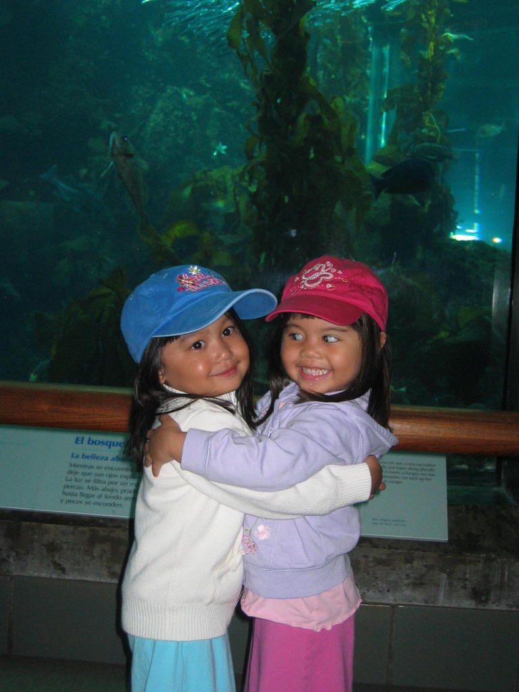

# Faith's User Page
### CSE 110 (Powell SP 23)

<p align="center">
  
</p>

Table of Contents
- [Faith's User Page](#faiths-user-page)
    - [CSE 110 (Powell SP 23)](#cse-110-powell-sp-23)
  - [About me](#about-me)
  - [My academic/coding journey](#my-academiccoding-journey)
  - [CSE 110 and I](#cse-110-and-i)


## About me 
<p align="center">
  
</p>

Hi! My name is **Faith Rivera** and I am a second year here at UCSD, Sixth College. More about school and I later, but here's more about the girl behind her code.
I was born and raised in San Diego, and I actually have a twin sister here at UCSD on the premed track- her name is Grace. We're actually roomates here on campus. Here's a photo of us when we were little- you can guess who is who. 


<p align="center">
  
</p>

*Grace isn't the biggest fan of code, so she left that job to me. I leave the bio stuff to her.*


In my free time, I enjoy dancing- I've danced for almost 14 years and my favorite styles are comptemporary, hip hop, and ballet. I also enjoy listening to music- I love R&B, hip hop, lowkey sad music, and Taylor Swift. 

I also love trying new spots to eat with loved ones. My favorites in San Diego are Thai Join on Adams (North Park), Menya Ramen (Mira Mesa), Uncle Biffs Cookies (Hillcrest), and more!

Here's a photo of San Diego that I like- 


## My academic/coding journey
I’m actually declared as a chemical engineering major at the moment, but am in the process of transferring into a computer science-oriented major (however the CS lottery turns out). I'm also an [IDEA Scholar](https://jacobsschool.ucsd.edu/idea/admitted-undergraduates/scholars), which has provided me with many opportunities to connect with UCSD's engineering community and give back to rising students. 

Giving back is one of my biggest missions: it reminds me of the quote 

>Be the change you want to see. 

I believe in action *through* intention, which is why I have performed a lot of outreach for high school girls in STEM and helped incoming UCSD engineering freshmen through the Summer Engineering Institute. I want to ensure the success of students and expand the diversity in STEM.

My outreach has also extended to computer science itself. I find it important to give back as I grow, especially since I feel relatively new to CS compared to some students here. I started coding my senior year of high school in Python, and have since learned other coding techniques and languages through UCSD's CSE classes. Because of this, **imposter syndrome is so real**, and I've navigated rude classmates to figuring out my coding workflow in a short two years. 

The coding classes I took here are:
- CSE 8a (Miranda)
- CSE 11 (Miranda)
- CSE 12 (Miranda)
- CSE 30 (Muller)
- CSE 100 (Niema)
  
And now CSE 110 :-)

Because of this, I felt compelled to tutor with CSE (I tutor for Prof Miranda for lower division classes.) I find it really cool that I went from understanding from...

```
System.out.println("hello, world!);
```

...to being able to explain basic data structures and better explain code in general. Tutoring betters me as a coder, classmate and learner as I am still learning from the students I help.


## CSE 110 and I
I’m hoping to get a better sense of SE in this class as well as the process of web development. I’m currently debating on the path I want to take professionally- the general ideas I have are:
1. Research computational chemistry 
2. SE
3. More front end design UX/UI

I hope that this class's focus on web dev will help me understand points 2 and 3 better and also give me a taste of team development dynamics. Professionally, I think this will help because I'm interested in diving into the following in the future:
- [ ] Internships
- [ ] Coding Projects
- [ ] Hackathons
- [x] Networking

I look forward to the learning and unlearning that this class will provide so that I have the tools to move forward from here.